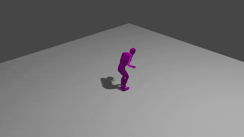

# Assignment 4 - Data-driven human motion synthesis


Hand-in: 4 May 2023, 14:00 CET


----

Leave your name, student ID, ETH email address and the URL link to your motion capture result video here.

- Name:
- Student ID:
- ETH Email:
- URL:

----


In this assignment, we implement data-driven human motion synthesis leveraging a learned motion space as introduced in the assignment [tutorial](https://docs.google.com/presentation/d/1pIZUsnCaHPd3rqx2RlSrJ9FMTHV6nhKrzUtpYnRGORk/edit?usp=sharing). 
You will implement various scoring functions to control the sampling in the learned motion space to synthesize desired behaviors.
We provide a codebase and a pre-trained motion primitive model.

You are required to solve the following tasks:
- (20%) Ex 1: Random sampling and visualization. (`scripts/gen_random.py`)
- (20%) Ex 2: Keep feet on the floor. (`scripts/gen_floor.py`)
- (30%) Ex 3: Control walking speed. (`scripts/gen_speed.py`)
- (30%) Ex 4: Reach goal location. (`scripts/gen_location.py`)

To achieve full points, you need to pass all the automatic tests and upload the visualization of the synthesized motions of each task. 


**IMPORTANT** 
- If a suspected plagiarism case is detected, you will get **zero** point from this assignment.
- Please push the generated result files as-is into your own repo for auto-grading. Please don't change its path and format, otherwise the autograding system will not parse your file correctly.

## Installation

**First**, create a virtual environment by running
```
python -m venv {path_to_venv}
source {path_to_venv}/bin/activate
```

**Second**, install all dependencies by running
```
pip install -r requirements.txt
```
Note that other versions might also work but not are not tested. 
In principle, this codebase is not sensitive to the Pytorch version, so please use the version that fits your own CUDA version and the GPU driver. Note that you may encounter errors like 
```
ERROR: jupyter-packaging 0.12.3 has requirement setuptools>=60.2.0, but you'll have setuptools 44.0.0 which is incompatible.
ERROR: ypy-websocket 0.8.4 has requirement y-py<0.7.0,>=0.6.0, but you'll have y-py 0.5.9 which is incompatible.
```
Ignore them for now.

## Setup
- Download our pre-trained checkpoints [here](https://drive.google.com/drive/folders/1Q6l_bl9Oz6-BrYz8u7DMf95wgpA_fQ1T?usp=sharing). These checkpoints correspond to the model config files.
Please put all the downloaded files to the folder `results/lisst/`, the structure should be like this:

  ```
  results
  │
  └───lisst
    │
    └───LISST_GEMP_v0
    │
    └───LISST_POSER_v0
    │
    └───LISST_SHAPER_v0
  ```
- Download and install [Blender](https://www.blender.org/download/). 
- Download and install the [LISST Blender add-on](https://github.com/yz-cnsdqz/LISST-blender/blob/release-0.2.0/lisst_blender_addon_20230417.zip) for motion visualization. 
You can follow the instructions below:
  1. Open preference window: `Edit->Preferences`.
  2. Install LISST add-on: click `Install` and select the zip file you download.
  3. Tick the checkbox to enable LISST add-on: 
  4. To use LISST add-on, please press `N` to open the sidebar and select `LISST`, it should look like this:  

## Ex.1 Random sampling and visualization

**Code:**

- Files:
  - `scripts/gen_random.py`

**Task:**

- Randomly sample diverse human motion and visualize using the LISST Blender add-on.


**Details:**
<!-- - Please first set `base_dir` to your project folder in the script.  -->
- Run the script with the command `python scripts/gen_random.py` to generate random motion. The generated motion results will be saved at `results/random.pkl`.
- Visualize the generated motion in blender.
  - Open the Blender scene `scene/random.blend`
  - Import the generated motion sequences using the `Add Animation Batch` function of the LISST Blender add-on. 
  - After importing, you can play the animation by pressing `space`. 
  - Save the animation visualization as a video at `vis/random.mp4`. You can either use screen capture or the animation rendering feature of Blender following this [demonstration](https://www.youtube.com/watch?v=3eJmISziyIY). 
- You can tune `n_seqs` to change the number of motion sequences you want to generate and tune `max_depth` to change the length of generated motion sequences. Note that importing many long motion sequences using the add-on will cost more time.  If the importinh time is too long on your machine, you can reduce `n_seqs` and `max_depth`.

If successful, you can see results like this: 


**Files to submit:**

`results/random.pkl`

`vis/random.mp4`

## Ex.2 Keep feet on the floor

**Code:**

- Files:
  - `scripts/gen_floor.py`
  
- Functions:
  - `LISSTGEMPGenFloorOP.eval_quality`

**Task:**
Due to the gravity in the real world, the human feet keep contact with the floor to support the human body while walking.
However, the learned kinematic motion model that we leverage is unaware of this contact constraint.
In this task, we will implement a scoring function for motion samples to encourage the generated motion to satisfy the feet-floor contact constraint.


**Details:**
<!-- - Please first set `base_dir` to your project folder in the script. -->
- Implement the scoring function `LISSTGEMPGenFloorOP.eval_quality`.

The floor score encourages the lowest feet joint to have the same height as the floor plane, which means in contact with the floor. The feet-floor distance for frame $t$ is defined as:

  $$d_{floor}^t = |\min\limits_{\forall j \in \{lfoot, rfoot, ltoes, rtoes\}} j_z - h_{floor}|$$

where $j_z$ is the z coordinate of joint $j$ and $h_{floor}$ is height of the floor.
The floor score for one motion primitive of $T$ frames is defined as:

  $$s_{floor} = e^{- {1 \over T} \sum\limits_{t=0}^{T-1} d_{floor}^t}$$ 

- Run the script with the command `python scripts/gen_floor.py` to generate motion. The generated `motion.pkl` results will be saved at `results/floor_random` and `results/floor_search`, corresponding to the random rollout results and search results respectively. A log file `quality_log0.pkl` will also be saved for auto testing.
- Open the Blender scene `scene/floor.blend` and visualize the generated motion in blender as in Ex.1.
Save the visualization of the search result as a video at `vis/floor_search.mp4`.  

If successful, you can see results like this: 




**Files to submit:**

`results/floor_random/motion.pkl`

`results/floor_random/quality_log0.pkl`

`results/floor_search/motion.pkl`

`results/floor_search/quality_log0.pkl`

`vis/floor_search.mp4`

## Ex.3 Control walking speed

**Code:**

- Files:
  - `scripts/gen_speed.py`
  
- Functions:
  - `LISSTGEMPGenSpeedOP.eval_quality`

**Task:**
In this task, we will implement a scoring function for motion samples to control the walking speed to be 1m/s.


**Details:**
<!-- - Please first set `base_dir` to your project folder in the script. -->
- Implement the scoring function `LISSTGEMPGenSpeedOP.eval_quality`.

The speed score encourages the root joint speed to be the same as the specified goal speed, which is 1m/s in this exercise. 
The root joint speed in one motion primitive of $T$ frames (exclude the first and last frames) can be calculated using the difference of root joint xy coordinates as:
  $$speed = {\|r_{xy}^{2:T} - r_{xy}^{0:T-2}\|_2 \over 2h},$$ 

where $r_{xy}$ denotes the xy coordinates of the root joint projection on the floor, $t_0:t_1$ denotes the sequence from frame $t_0$ (included) to frame $t_1$ (not included).

The speed score for one motion primitive of $T$ frames is defined as:

  $$s_{speed} = e^{-{1 \over T-2} \sum\limits_{t=1}^{T-1} |speed^t - g_{speed}|}$$

Please also implement the floor contact score as in EX.2.
- Run the script with the command `python scripts/gen_speed.py` to generate motion. The generated `motion.pkl` results will be saved at `results/speed_random` and `results/speed_search`, corresponding to the random rollout results and search results respectively. A log file `quality_log0.pkl` will also be saved for auto testing.
- Open the Blender scene `scene/speed.blend` and visualize the generated motion in blender as in Ex.1.
Save the visualization of the search result as a video at `vis/speed_search.mp4`.  

If successful, you can see results like this: 


**Files to submit:**

`results/speed_random/motion.pkl`

`results/speed_random/quality_log0.pkl`

`results/speed_search/motion.pkl`

`results/speed_search/quality_log0.pkl`

`vis/speed_search.mp4`

## Ex.4 Reach goal location

**Code:**

- Files:
  - `scripts/gen_location.py`
  
- Functions:
  - `LISSTGEMPGenLocationOP.eval_quality`

**Task:**
In this task, we will implement a scoring function for motion samples to control the human to walk to a goal location, i.e., $(1, 1)$ on the floor plane.


**Details:**
<!-- - Please first set `base_dir` to your project folder in the script. -->
- Implement the scoring function `LISSTGEMPGenLocationOP.eval_quality`.

The location score encourages the human to move its root joint to the goal location. In this excercise, we consider 2D location on the xy-plane and set the goal location as $(1, 1)$.

The location score encourages the last frame root joint to be over the goal location, as defined by:

  $$s_{location} = e^{-\| r_{xy}^{T-1} - g_{location}\|_2}$$

Please also implement the floor contact score as in EX.2.
- Run the script with the command `python scripts/gen_location.py` to generate motion. The generated `motion.pkl` results will be saved at `results/location_random` and `results/location_search`, corresponding to the random rollout results and search results respectively. A log file `quality_log0.pkl` will also be saved for auto testing.
- Open the Blender scene `scene/location.blend` and visualize the generated motion in blender as in Ex.1.
Save the visualization of the search result as a video at `vis/location_search.mp4`.  

If successful, you can see results like this:


**Files to submit:**

`results/location_random/motion.pkl`

`results/location_random/quality_log0.pkl`

`results/location_search/motion.pkl`

`results/location_search/quality_log0.pkl`

`vis/location_search.mp4`

## Final Note

- We will release our offcical code after the deadline. Further announcements will be sent.
- You may find implemented search-based control can be ineffective for challenging tasks if you tune the goal speed and locations in the exercises. Moreover, you may find the scores we implemented functions similarly to the rewards in reinforcement learning. Actually one more advanced synthesis scheme is to combine reinforcement learning and search-based control and we refer to [GAMMA](https://yz-cnsdqz.github.io/eigenmotion/GAMMA/) for futher reading.


----

----

----

# APPENDIX: Linear Shaped Skeletons for Human Body Modelling


**LISST** is a *light-weight*, *differentiable*, and *parametric* human body model focusing on skeletons. Its down-streaming applications cover **markerless motion capture**, **motion synthesis and control**, **sports**, **game development**, **healthcare**, and beyond.
We further create an extension package [LISST-blender](https://github.com/yz-cnsdqz/LISST-blender) to use our model for character animation and motion re-targeting.


Provided the `body shape`, `body pose`, and `root configurations`, a posed body skeleton is produced via forward kinematics, and is placed in the world space.
We employ the [CMU Mocap](http://mocap.cs.cmu.edu/) dataset to build the body skeleton, learn the shape spaces, pose priors, and others.
Beyond the 31 body joints in CMU Mocap, additional bones are incorporated into the kinematic tree and the shape space, based on human anatomical statistics.


# Notice
- This version is to provide a framework for Assignments of the course [Digital Humans 2023](https://vlg.inf.ethz.ch/teaching/Digital-Humans.html) at ETH Zurich.
- Code, data, and model will be updated in future versions.
- [The official tutorial slides are here.](https://docs.google.com/presentation/d/1n9_FWMsHK-Iej1kg661XKpPUYipbXGGwX8pEMvK7uZo/edit?usp=sharing)


# Installation

**First**, create a virtual environment by running
```
python3 -m venv {path_to_venv}
source {path_to_venv}/bin/activate
```

**Second**, install all dependencies by running
```
pip install -r requirements.txt
```
Note that other versions might also work but not are not tested. 
In principle, this codebase is not sensitive to the Pytorch version, so please use the version that fits your own CUDA version and the GPU driver. Note that you may encounter errors like 
```
ERROR: jupyter-packaging 0.12.3 has requirement setuptools>=60.2.0, but you'll have setuptools 44.0.0 which is incompatible.
ERROR: ypy-websocket 0.8.4 has requirement y-py<0.7.0,>=0.6.0, but you'll have y-py 0.5.9 which is incompatible.
```
Ignore them for now.


